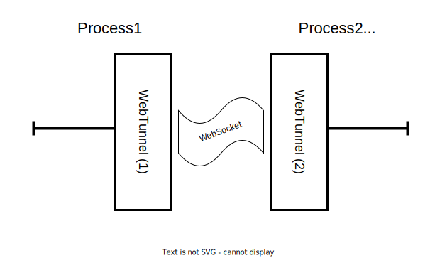

# SOF, the Structure-oriented Framework

> 本文为 SOF 框架总体思想的概览。具体实现可能与本文有所出入。

> 本文中以“实现细节”为标题的部分为\_Kerman 在尝试实现 SOF 框架时的一些见解，仅供参考。

## 为什么需要 SOF

SOF 目的是调控数据流与控制流，并对常用功能进行封装。

可能的应用场景：

- 前后端数据交互
- 响应式 UI

## SOF 框架 的构成

为降低程序的耦合性，SOF 框架 将程序划分为各种 `Structure`，以 `Structure` 和 `Structure` 之间的**连接**来搭建起整个项目。

以下是 SOF 框架 应当包含的一些 `Structure`。



### Port

`Port` 可以看作是框架的数据交互部分，它把程序划分为**对象**和**环境**，而其自身是对象和环境进行数据交互的场所。

`Port` 仅可以和另一个 `Port` 连接，或者不连接。

`Port` 的连接是双向的，双方都可以主动通过 `Port-Port` 连接向对方发送数据，也可以通过自身在对方 `Port` 中绑定的回调函数被动接受数据。

`Port` 本身并不加工处理数据，它只是数据交换接口的抽象。

使用 `Port` 时尤其应注意 `is-a` 和 `have-a` 问题。例如，当需要实现一个自动转发数据的模块，则可以通过编写一种新的 `Port` 来实现该功能。而如果需要对数据进行计算，则应当编写一个 `Component` 来进行数据的计算，并在其中包含一个 `Port` 来和外界交互。`Port` 只负责：1. 接受数据并移交计算; 2. 对外界/环境主动发送数据。

“对象-环境”的界线是相互的。如果 `Component A` 包含 `Port A`，`Component B` 包含 `Port B`，而 `Port A` 和 `Port B` 相互连接，则对于 `Component A` 而言，`Component A` 是对象（即它自己），而 `Component B` 为环境，它通过 `Port A` 实现了对象和环境的交互。而对于 `Component B` 来说则反之。

对象内部是一个相对独立的区域。`Component A` 可以主动唤起 `Port A` 来向外界发送数据，也可以被 `Port A` 唤起来处理其接收到的数据。`Component A` 并不关心 `Port A` 和外界的什么结构连接了，只负责处理其包含的各个 `Port` 中流通的数据流。这即为对象内部的独立性。

#### 实现细节

`Port`之间的数据传输，如果通过互相绑定回调函数的方式实现，需要考虑如下问题：

1. 参数问题

传输的数据作为回调函数的参数传入，其个数可不同。但时能够互相链接的`Port`A 和 B 应当满足 A 的输出恰与 B 的输入类型相同，反之亦然。

需要注意的一点是，为了数据流和控制流的分离，应当要求数个参数中，其中的任何一个参数要么是数据流，要么是控制流。

考虑到数据可能会跨设备传递，所有传输的数据必须保证其是可序列化的。

2. 异步还是同步？

同步可以避免很多在传输终端的麻烦，但是异步传输使得数据可以通过 WebSocket 等方式跨设备传递。

3. 错误处理

由于采用回调函数的方式传输数据，任何一步中抛出的异常如果不被捕获，就会来到最初调用`send`的一方。这一点值得商榷。

另外一种方式是抛出的异常均被认为会导致程序终止，而传输的成功与否通过返回值来判断。这样的话，每一个传输步骤可能需要自己捕获异常。缺点是出错后，关于出错原因的信息可能不足，但是有较好的容错能力。

4. 泛型

首先两个`Port`能否连接，取决于它们的输入输出类型是否对应。

但是考虑如下情况：PortA 和 PortB 的输入输出分别都是一个字符串，但是 PortA 的输入输出是 JSON，而 PortB 的输入输出是 yaml。此时一般来说类型系统并不能拒绝二者的链接，但是这样的链接是没有意义的。曾经试图引入`protocol`的概念以解决这个问题，但是其大大增加了耦合度，得不偿失。

一个参考：

```typescript
abstract class Port<ParamsI extends Param[], ParamsO extends Param[]> {
  protected _linkedTo: Port<ParamsO, ParamsI> | null = null;

  public get linkedTo(): Port<ParamsO, ParamsI> | null {
    return this._linkedTo;
  }

  protected link(to: Port<ParamsO, ParamsI>): boolean {
    this._linkedTo = to;
    return true;
  }

  async send(...params: ParamsO): Promise<boolean> {
    if (!this.linkedTo) return false;
    return await this.linkedTo._recv.apply(this.linkedTo, params);
  }

  // async
  protected abstract _recv(...params: ParamsI): Promise<boolean>;

  static connect<ParamsA2B extends Param[], ParamsB2A extends Param[]>(
    portA: Port<ParamsB2A, ParamsA2B>,
    portB: Port<ParamsA2B, ParamsB2A>
  ): boolean {
    return portA.link(portB) && portB.link(portA);
  }
}

type PortToConnect<ThisPort extends Port<any, any>> = ThisPort extends Port<
  infer ParamsI,
  infer ParamsO
>
  ? Port<ParamsO, ParamsI>
  : never;
```

#### 几种有代表性的`Port`（作为范例，并非必须实现）

- 普通端口：`OrdinaryPort`

- 可锁定端口：`LockablePort`，除支持 `OrdinaryPort` 的功能外可以拦截并抛弃某一个方向的数据流。如设置为 `Out-only` 则抛弃环境向对象发送的消息，如设置为 `In-only` 则抛弃对象向环境的消息。

### Component

`Component` 则是上文提到的“对象”，提供 `Port` 与环境交互。

一个 `Component` 应当包含一个或以上的 `Port`。如果一个对象包含 `Port` 且没有必要对其他程序提供接口，则其应当被实现为一种 `Component`。

### 实现细节

1. 一个`Component`中有哪些`Port`，这一点是否需要在`Component`的泛型类型中体现？目前认为是不需要的。

2. 一个`Component`显然只能存在于一个进程中。

#### 几种有代表性的`Component`

- 管道：`Tunnel` 
  
  用在两个 `Port` 无法直接连接时进行辅助连接。例如 `WebTunnel` 可以将不在同一个程序中的两个 `Port` 通过网络连接。

  

#### Distributor

`Distributor` 用来实现超过两个或不定个数的 `Port` 之间的相互连接。

其中一个 `Port` 发出的数据包其余的 `Port` 均能收到。



#### Extender

`Extender` 用来实现一对多和多对一的 `Port` 之间的相互连接。

位于 `Single-End` 端的 `Port` 发出的数据能被所有 `Multi-End` 端的 `Port` 接受，或由其内部的 `Selector` 函数决定发送给哪一个端。位于 `Multi-End` 端的 `Port` 发出的数据只能被 `Single-End` 接收。

例如，通过恰当地协调 `Selector` 的分配方式，可以通过用两个 `Extender` 与一个 `Tunnel` 组合模拟多 `Tunnel` 的组合，达到类似 `Tunnel` 复用的效果。这一点在建立多条 `Tunnel` 代价昂贵时尤其有用。

附记：两个 `Extender` 与一个 `Tunnel` 组合模拟多 `Tunnel` 的组合在路由匹配的场景下比较常见，只不过在传统的项目中，`Extender` 是耦合在诸如 `Flask` 之类的框架之中。使用两个 `Extender` 与一个 `Tunnel` 组合可以轻量级地实现路由控制的功能，而且由于 `Port` 具有对数据流数据类型的控制，可以自动实现 `api` 的合法性校验，一举两得。



## SOF 框架 的辅助功能

### DataClass

`DataClass` 是一种纯数据类，不允许在其中包含除 `DataClass` 以外类型的对象，且全部数据段皆为 `public`。

`DataClass` 允许用户定义以下类型的函数：

- Compute：类似于 Vue 中的计算属性，可以用来提供常用的方法的计算。
- Mutation：调用 `Mutation` 是改变 `DataClass` 中的数据的唯一途径。
- Watch：用于监控 `DataClass` 中数据的变化。

以下是对此三者的一个简单的示例。

如果用户定义 `DataClass Cart` 购物车这样一个数据类，那么可以编写一个 `Compute TotalPrice = apple * 5 + banana * 3` 的 `Compute`，那样在访问 `CartA.TotalPrice` 时则返回 `CartA` 中的商品总价。

用户可以定义 `Mutation PutAnApple: apple += 1` 这样一个 `Mutation`，则通过调用 `CartA.PutAnApple()` 是改变 `apple` 数量的一个方法。`Mutation` 可以有参数，但是越过 `Mutation` 直接修改数据的方式是不被允许的，也就是说 `CartA.apple` 可以获取到值，但是 `CartA.apple = 1` 则不被允许。

定义 `Watch apple(old, new): print("apple: ", old, new)` 可以在 `apple` 变量的值发生改变的时候打印出变化前后的值。注意，处于安全性考虑，`Watch` 中的函数不能干涉对象的变化。

`DataClass` 应当有一些扩展，例如 `List`，`Map` 之类的数据，便于操作和管理数据。类似地，`List` 的 `Watch` 应当传入的参数还有被改变元素的下标，应该根据实际情况设计接口。

从本质上来说，`DataClass` 作为数据的一种管理方式，其本身也应当具有数据的特征，即一个 `DataClass` 应当是天然可以被拷贝和可以被序列化的，这也可以方便其作为数据在 `Port` 之间或 `Tunnel` 之中传递。

### Synchronizer

`Synchronizer` 用于同步 `DataClass`。`Synchronizer` 可以视作是对 `DataClass` 的一个包装。一个 `Synchronizer` 包含一个 `DataClass`，并对外提供一个 `Port` 用于通信和数据交换。需要同步两个 `DataClass` 的数据时，两个 `DataClass` 都需要使用 `Synchronizer` 进行包装，并将两个 `Synchronizer` 的 `Port` 直接或间接地连接起来。

`Synchronizer` 监控其包含的 `DataClass` 中所有数据段的变化并将变化打包成一个 `Patch`（`Patch` 也是 `DataClass` 的一种，具有 `DataClass` 所具有的所有属性），通过 `Port` 发送。同样的，如果 `Synchronizer` 从其 `Port` 接受到一个 `Patch`， 则也会根据这个 `Patch` 中的数据来更新自身数据。

由于 SOF 框架 松耦合的特性，两个 `Synchronizer` 的 `Port` 只需要确保连接即可实现通信，而且由于 `Patch` 是 `DataClass` 的特性，使得 `Patch` 可以被序列化后在 `Tunnel` 中传输。进而，通过使用 `WebTunnel` 可以方便地实现在网络可达的设备间的 `DataClass` 同步。

更进一步，如果恰当地改写数据库的调用接口，可以容易实现类似 `ORM` 的结构。

由于 `Synchronizer` 的本质是数据的同步，这与 `Vue` 的 `v-bind` 有共通之处，如果使用 SOF 框架 的思想编写一个前端框架也许会有意想不到的收获。

### Shadow & Exposer

`Shadow` 和 `Exposer` 用于实现一个对象的间接调用。其中 `Exposer` 称为“供体”，`Shadow` 称为“配体”。`Exposer` 的结构类似于 `Synchronizer`，能包装一个对象，并提供一个 `Port` 作为数据流的通路。而 `Shadow` 则生成一个虚拟的（mock），与 `Exposer` 包装的对象同类型的一个对象。在外界看来，`Shadow` 和 `Exposer` 都包装了一个对象，其接口和功能类似，但实际上真正的对象实例只有被 `Exposer` 包裹的那一个，对 `Shadow` 中虚拟对象的调用的请求最终会被打包成一个 `Request`（是 `DataClass` 的一种），通过其 `Port` 传输出去。若 `Exposer` 接收到了这个 `Request`，则其会解析其中的参数并据此发送给其内部包装的对象，再将对象的返回值包装成 `Response`（也是一种 `DataClass`）通过其 `Port` 发送出去。

如果通过 `Shadow` 调用虚拟对象时传入的参数无法被序列化（例如传入了一个对象或回调函数等等），则会发生“供-配反转”，`Shadow` 会为该参数创建一个 `Exposer` 并包裹之，将该 `Exposer` 的 `Port` 连接到 `Shadow` 自身，并在 `Request` 中插入一个占位符，要求接收到这个 `Request` 的 `Exposer` 创建一个 `Shadow` 来作为该参数的配体，而此时接收到 `Request` 的 `Exposer` 会将其创建的 `Shadow` 的 `Port` 连接到 `Exposer` 自身，然后通过管线复用技术（见 `Extender`）来复用“供-配反转”前的 `Shadow` 和 `Exposer` 之间的线路，从而建立起“供-配反转”后的 `Shadow` 和 `Exposer` 之间的线路，进而可以将新创建的 `Shadow` 作为参数传递给 `Exposer` 包装的对象。

在实际生产中，`Shadow & Exposer` 技术可以模拟实现对象的跨端传递。将数据库对象传递到前端是一个危险的想法，但是使用`Shadow & Exposer` 技术可以创造出许多优秀安全的新的架构。比如，考虑一个多用户系统，我们假定不同的用户有不同的权限。在用户登陆后可以在后端生成一个 `Logined` 对象的实例，其方法是此时用户可能进行的操作，例如“登出”或“捐赠”等，然后用 `Exposer` 包装之。而前端可以创建一个 `Shadow`，和后端建立一条 `WebTunnel` 的链路，通过 `WebTunnel` 与后端的 `Exposer` 建立连接，从而将原本的 `api` 调用简化为对象方法的调用，将原本需要的 `api` 文档转化为前后端都需要包含的 `Logined` 对象的接口。同时，由于后端也可以访问这些对象，使得 Session 的管理和系统测试更为容易。

## 后记

由于笔者水平有限，目前没有时间没有能力实现出一套 SOF 框架，故将我对其的期盼列举于此，希望有大佬认可我提出的 SOF 框架，编写出一套可用的实现。

以上内容都是我和陈琛在交流中想出，如有雷同纯属巧合。
